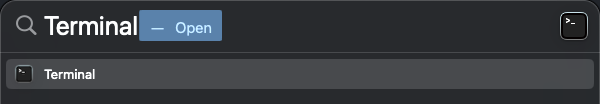

# How to Install and Set Up Git on macOS

## Overview

Git is a popular version control system that allows developers to track changes in their code efficiently. This guide provides step-by-step instructions on installing and configuring Git on macOS.

!!! note "Note"

    In this guide, we'll use Homebrew to install Git on macOS. Alternatively, you can choose other [installation methods](https://git-scm.com/downloads/mac){:target="\_blank"} based on your preferences (outside the scope of this guide).

!!! info "Info: What is Homebrew?"

    [Homebrew](https://brew.sh/){:target="\_blank"} is a popular package manager for macOS that simplifies the installation, updating, and management of software and command-line tools. Its benefits include ease of use, a vast library of packages, and automatic handling of dependencies, making it an efficient tool for developers and users to streamline software management on macOS.

## Step 1: Install Git on macOS

1 - **Open** a terminal by **typing** _Terminal_ in Spotlight:

!!! example "Example"

    

---

2 - Install Homebrew:

```bash title="Bash"
/bin/bash -c "$(curl -fsSL https://raw.githubusercontent.com/Homebrew/install/HEAD/install.sh)"
```

---

3 - Install Git via Homebrew:

```bash title="Bash"
brew install git
```

---

4 - Verfiy the installation:

```bash title="Bash"
git --version
```

!!! success "Success!"

    ```bash title="Bash"
    git version 2.x.x
    ```

## Step 2: Configure Git

After installing Git, you need to configure your user details.

1 - Set your name:

```bash title="Bash"
git config --global user.name "Your Name"
```

---

2 - Set your email:

```bash title="Bash"
git config --global user.email "your-email@example.com"
```

---

3 - Verify the configuration:

```bash title="Bash"
git config --list
```

!!! example "Example"

    ```bash title="Bash"
    user.name=John Doe
    user.email=john.doe@email.com
    ```

## Conclusion

Congratulations! You've successfully installed and set up Git on your macOS. You can now jump to the [_Introduction to GitHub_](set-4-intro-github.md) or proceed to the [_Linux Installation_](set-2c-linux.md) section.
