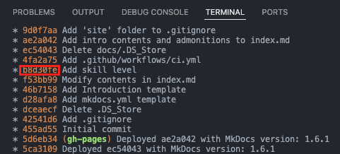
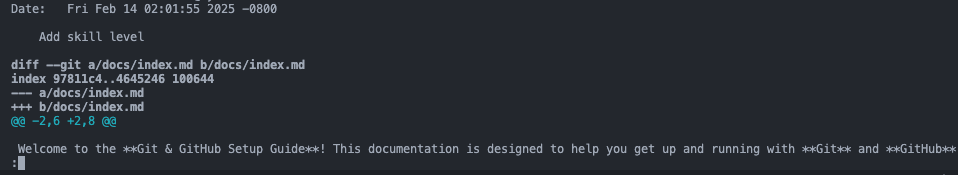

# Basic Git Commands

## Initializing & Cloning Repositories

These commands help you create or copy a Git repository.

- Initializes a new Git repository in the current directory

```sh
git init
```

---

- Clones an existing repository from a remote server

```sh
git clone <repository_url>
```

!!! example "Example: Git Clone"

    git clone https://github.com/user/repo.git

---

- Clones a repository into a specific directory

```sh
git clone <repository_url> <directory>
```

!!! example "Example: Git Clone with a specific directory"

    git clone https://github.com/user/repo.git my-project-folder

## Checking Repository Status

These commands help you check the current state of your repository.

- Shows which files are modified, staged, or untracked

```sh
git status
```

---

- Displays the commit history

```sh
git log
```

---

- Shows a compact, graphical commit history

```sh
git log --oneline --graph --all
```

---

- Displays details of a specific commit

```sh
git show <commit_hash>
```

!!! example "Example: Git Show"

    ```sh
    git log --oneline --graph --all
    ```

    

    ```sh
    git show b8d30fe
    ```

    

## Staging and Committing Changes

These commands help you save and track changes.

- Adds a specific file to the staging area

```sh
git add <file>
```

---

- Adds all changes in the current directory to the staging area

```sh
git add .
```

---

- Commits the staged changes with a message

```sh
git commit -m "commit message"
```

---

- Edits the last commit message

```sh
git commit --amend -m "new message"
```

!!! warning "Warning!"

    The _git commit --amend -m "new message"_ command **only works locally** by default. It modifies the most recent commit in your local repository, but it does not automatically affect the remote repository.

## Branching and Merging

These commands help you work with multiple versions of your project.

- Lists all branches in the local repository

```sh
git branch
```

---

- Creates a new branch

```sh
git branch <branch_name>
```

---

- Switches to an existing branch

```sh
git checkout <branch_name>
```

---

- Creates and switches to a new branch

```sh
git checkout -b <branch_name>
```

---

- Merges a specified branch into the current branch

```sh
git merge <branch_name>
```

---

- Deletes a branch (if merged)

```sh
git branch -d <branch_name>
```

---

- Force deletes a branch

```sh
git branch -D <branch_name>
```

!!! danger "Danger!"

    Since -D doesn’t prompt for confirmation or check merge status, you might accidentally delete a branch you didn’t intend to. If you mistype the branch name or delete the wrong branch, you could lose progress.

## Working with Remote Repositories

These commands help you interact with remote repositories.

- Lists all remote repositories

```sh
git remote -v
```

---

- Adds a remote repository named “origin.”

```sh
git remote add origin <repository_url>
```

---

- Pushes local commits to a remote branch

```sh
git push origin <branch_name>
```

!!! tip "Tip: The .gitignore File"

    When uploading local commits to a remote branch, it’s wise to include a .gitignore file. This file tells Git which files and directories to exclude from version control, keeping unnecessary or sensitive items out of the repository.

---

- Fetches and merges changes from a remote repository

```sh
git pull origin <branch_name>
```

---

- Downloads new data from the remote repository without merging

```sh
git fetch
```
