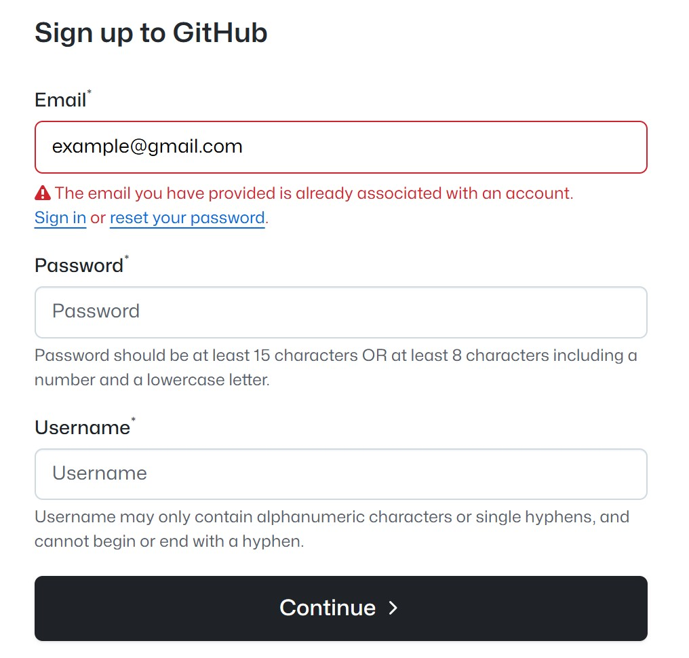
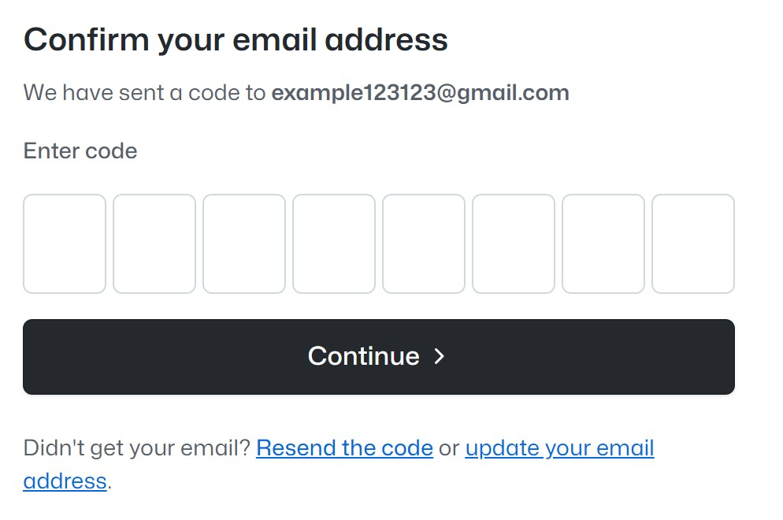
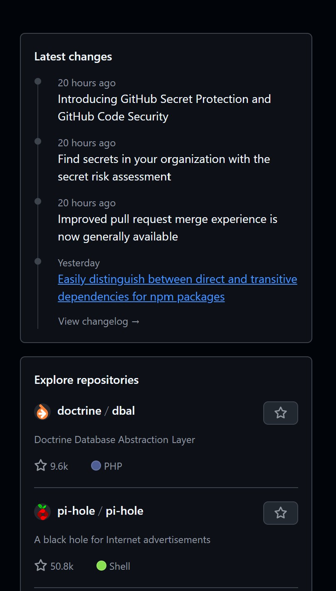
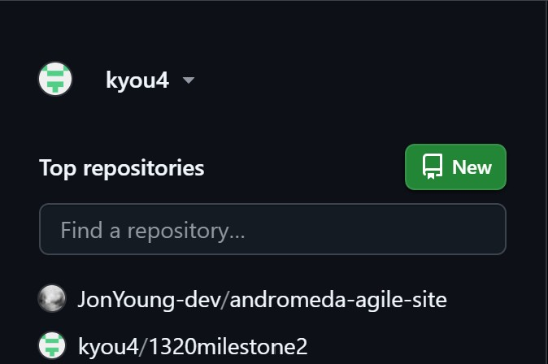

# Introduction to Github

## Overview

### What is Github?

GitHub is a web-based platform that makes it easier to manage and share coding projects. It builds on Git, a tool that helps track changes to files, by providing a place where projects can be stored and worked on from anywhere. Imagine it as an online workspace where multiple people can collaborate on the same project without losing track of who made what changes.

!!! note "Note"

    A common misunderstanding that Git and GitHub are closely related because their names sound similar, but they are actually completely different tools.

### Learning Outcomes (Beginners)

By end of this guide, you will be able to:

- **Create Github account** – A platform to store, share, and track changes in your coding projects.
- **Create and manage repositories** – Set up and organize your projects on GitHub.
- **Clone repositories** – Copy a project from GitHub to your computer to work on it.
- Commit changes – Save your work and note the changes you’ve made.
- **Push and pull changes** – Upload your changes to GitHub or get updates from others.
- **Work with branches** – Create separate versions of your project to make changes without affecting the main one.
- **Merge changes** – Combine your branch changes with the main project when you're done.

It may seem overwhelming at first, but don’t worry - step-by-step guides are available to help you through each part!

## Register an Account

Before you begin, you must register an account to use Github. There are multiple ways to sign-up for Github, but for this specific example, we will guide you how to register with an **email**.

1.  Open Github's homepage, and type in your email provided in the box on the center of the page.
    
    This will take you to the page with the registration form.

2.  Your email will be pre-filled from the previous step, so you will only need to add your password and username.
    

    !!! tip "Tip"

        It's a good idea to choose a professional username, as you may use this account to link to your resume or professional profiles in the future.

3.  Lastly, you will need to verify your email by entering the 6-digit code sent to your inbox.
    

!!! Success "Success"

    You've successfully created a github account!

## Website Overview

Here are key parts of the site that you'll interact with as a beginner, each serving a unique purpose— from navigating your profile and repositories to managing notifications and accessing tools

### Navigation

The GitHub navigation bar gives you quick access to key areas like your profile, repositories, and notifications. You can also search for projects, create new repositories, and access pull requests and issues.

### Exploration

The right sidebar on the homepage displays various public repositories created by other users, allowing you to explore projects from the community. It also highlights the latest updates and changes on GitHub, including new features and improvements.

### Personal repositories

The left sidebar is the user profile and repository pages shows a list of repositories a user created or contributed to. The naming convention typically follows the format of "owner/repository-name" (where "owner" is the user or organization that created the repository, and "repository-name" is the project name).

## Conclusion

You're all set to start using GitHub! With the knowledge of how to navigate the platform, you'll be able to explore GitHub and make the most of it on your coding journey.
