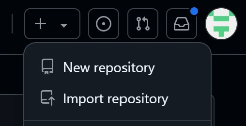
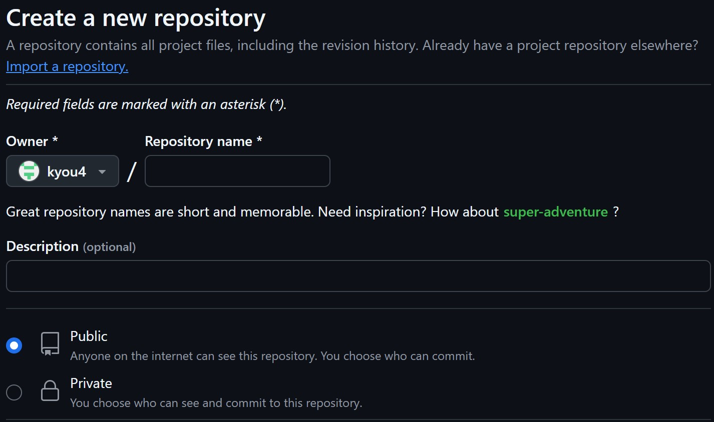

# Setting up the first Github Repository

Creating a GitHub repository is the first step to hosting your project's code, or other files on GitHub. Follow the steps below to create your own GitHub repository.

## Creating a Repository

1.  If you don't already have a GitHub account, you can sign up at [Github](https://github.com/signup). You can refer back to the **Introduction to GitHub** for signup assistance. Once you have an account, sign in.

2.  You should already be in the homepage once logged in. In the top right corner, click the "+" sign, then select New repository.

    

    !!! tip "Tip"

        Alternatively, you can directly access the New Repository page by typing github.com/new in your browser's address bar. This will redirect you to the exact same page as clicking the New repository button.

3.  On the "Create a New Repository" page, you must fill in the **Repository name** field and choose whether to make it **Public** or **Private**. Descriptions are optional and can be modified down the road.

    

4.  Once everything is filled, you can go ahead and press **Create Repository** to create your very first personal repository!

    !!! Success "Success"

        You've successfully created a github repository account!

!!! info "Info"

     A Git repository on its own has limitations. To get the most out of it, you’ll want to integrate your coding project with the repository, allowing you to track changes, collaborate, and manage your work more effectively.

## Conclusion

Congrats! You’ve just created your first GitHub repository. Now you're ready to start uploading and managing your project files. The next step will guide you on how to use Git with GitHub to track changes, collaborate with others, and make the most out of your repository.
